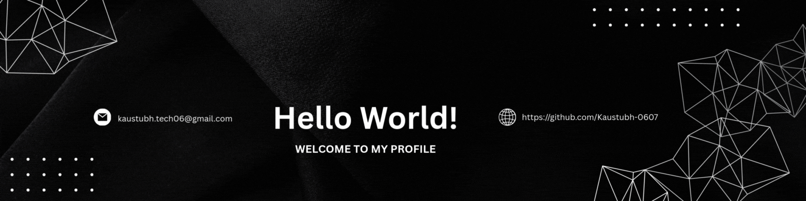

<h1 align="center">Hi World 👋, I'm Kaustubh</h1>
<h3 align="center">ECE Undergraduate | Python & C Developer | Semiconductor & Embedded Systems Enthusiast | Exploring AI & ML</h3>

  
  &nbsp;&nbsp;
  

# 🚀 About Me

I’m an **Electronics & Communication Engineering undergraduate** who loves building **real-world systems at the intersection of software and core engineering**.

I focus on **learning by building** — turning concepts from **Control & Instrumentation, Python, and AI** into practical, working projects. I strongly believe that **clarity, consistency, and fundamentals** matter more than hype.

# 🔭 What I’m Currently Working On
- 🤖 **AI-powered Chatbot projects** using Python & Chat UI frameworks  
- 🧠 Strengthening **Data Structures & Algorithms** (logic + optimization)  
- 🛠 Building **Python applications** using OOP, SQLite, and GUI frameworks  
- ⚙ Exploring **Control & Instrumentation systems** with software integration  
- 🔗 Projects that **bridge ECE concepts with software systems**

# 👯 I’m Looking to Collaborate On
- 💡 **Chatbot & AI-based tools** (assistants, automation, NLP experiments)  
- 🧩 **Open-source Python projects** with clean architecture  
- ⚡ **ECE + Software hybrid projects** (dashboards, simulators, monitoring systems)  
- 🎓 Student-driven technical communities & learning-in-public initiatives

# 🤝 I’m Looking for Help With
- 🏗 Designing **scalable chatbot architectures**  
- 🧼 Writing **production-quality Python code**  
- 🔄 Applying **instrumentation & electronics concepts** in software projects  
- 🌱 Open-source workflows (issues, PRs, best practices)

# 🌱 Currently Learning
- 🐍 **Advanced Python** (OOP, databases, automation, chatbots)  
- 📊 **Data Structures & Algorithms**  
- 🤖 **AI & Machine Learning fundamentals**  
- 📡 Core **ECE subjects** with practical, industry-oriented focus

# 💬 Ask Me About
- 🤖 Building **Python chatbots from scratch**  
- 🧠 DSA learning strategies for students  
- ⚙ Control & Instrumentation basics (NTPC C&I exposure)  
- 🔗 Combining **ECE theory with software development**

  

# ⚡ Fun Fact
🏆 **Jagran Genius Award** recipient  
🎓 **British Council Certified – C1 Advanced English**  
🧩 Featured Project — IoT-Enabled Arduino Mystery Maze Game
💡 I enjoy simplifying complex technical ideas and turning theory into real, working systems.

# 🌐 Socials:
  

# 💻 Tech Stack:
      

# 📊 GitHub Stats:
 
 

# ✍️ Random Dev Quote

# 🔝 Top Contributed Repo

---

